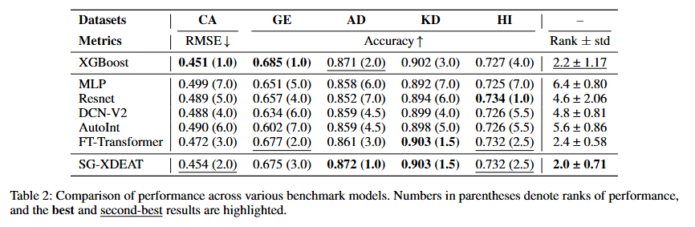
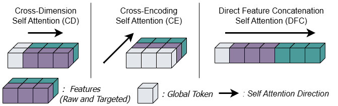
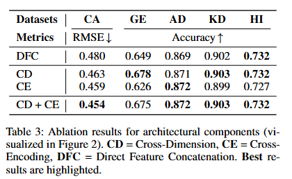
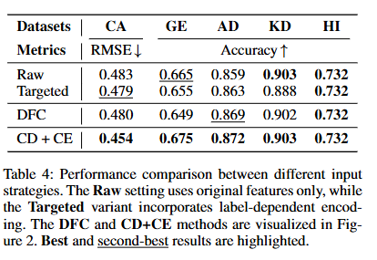
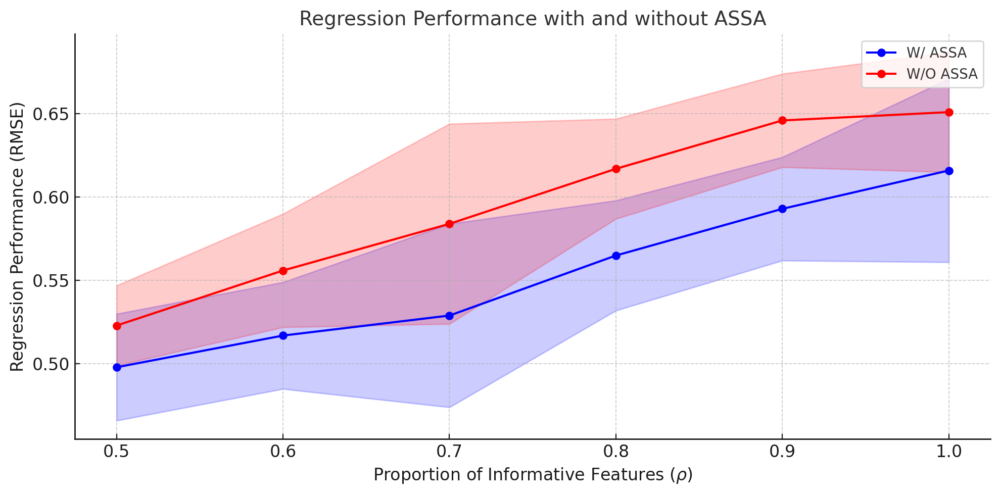

# SG-XDEAT Tabular Learning ( AAAI )

Abstract: We propose SG-XDEAT (Sparsity-Guided Cross-Dimensional and Cross-Encoding Attention with Target-Aware Conditioning), a novel framework designed for supervised learning on tabular data. At its core, SG-XDEAT employs a dual-stream encoder that decomposes each input feature into two parallel representations: a raw value stream and a target-conditioned (label-aware) stream. These dual representations are then propagated through a hierarchical stack of attention-based modules. SG-XDEAT integrates three key components: (i) cross-dimensional self-attention, which captures intra-view dependencies among features within each stream; (ii) cross-encoding self-attention, which enables bidirectional interaction between raw and target-aware representations; and (iii) an Adaptive Sparse Self-Attention (ASSA) mechanism, which dynamically suppresses low-utility tokens by driving their attention weights toward zero—thereby mitigating the impact of noise. Empirical results on multiple public benchmarks show consistent gains over strong baselines, confirming that jointly modeling raw and target-aware views—while adaptively filtering noise—yields a more robust deep tabular learner.


## 📂 Repository Structure
```
SG-XDEAT Tabular Learning/
├── Supplementary_Material/            # Supplementary resources
│ ├── Experiments/                     # Experimental results
│ │ ├── ASSA/                          # Sparsity Related experiments
│ │ ├── Architectural Comparison/      # Comparison across model architectures (  )
│ │ ├── Input Strategies/              # Different input handling strategies ( Raw & Targeted )
│ │ ├── Performance Comparison/        # Performance benchmarking
│ │
│ ├── Appendix.pdf                     # Appendix
│ ├── ReproducibilityChecklist.pdf     # Checklist
│
├── Figure/                            # Figures & Tables
├── SG-XDEAT.pdf                       # Conference Paper
├── README.md                          # Documentation
```

## 📊 Experiments
### 🔑 Main Results
We use **five datasets**: `AD`, `CA`, `HI`, `GE`, and `GE`.  
The corresponding code is located in **`Supplementary_Material/Experiments/Performance Comparison`**.  

For each dataset, we evaluate:  
- **6 benchmark models**  
- **Our proposed method: SG-XDEAT**

### 🏆 Final Results


---
### 🔀 Architectural Variants


In this experiment, we evaluate four different **model variants**:

1. **Direct**  ( CDFC )
   - ** Self-Attention ** on all representations.

2. **Cross-Dim only**  ( CD )
   - Uses only the **Cross-Dim** component in SG-XDEAT.
   - Consider dependencies among features.

3. **Cross-Enc only**  ( CE )
   - Uses only the **Cross-Enc** component in SG-XDEAT.
   - Consider dependencies among encodings.
  
4. **Cross-Dim + Cross-Enc**  ( CD+CE )
   - Uses the ** Cross-Dim & Cross-Enc ** component in SG-XDEAT.
   - Consider both dependencies among features and encodings.

The corresponding code is located in **`Supplementary_Material/Experiments/Architectural Comparison`**

### 🏆 Final Results


---
### 🎯 Input Strategy
In this experiment, we evaluate two types of **input strategies**:

1. **Raw Stream** : Direct raw feature values.  

2. **Targeted Stream** : Feature values conditioned on labels (using PLE-T & DecisionTreeEncoder).
     - *On Embeddings for Numerical Features in Tabular Deep Learning*  
     - *Winning the KDD Cup Orange Challenge with Ensemble Selection*  

We also investigate their **combinations**, such as **DFC** and **CD+CE**.

The corresponding code is located in **`Supplementary_Material/Experiments/Input Strategies`**

### 🏆 Final Results


---
### ✂️ Sparsity
We construct a synthetic regression benchmark where only a subset of features is informative. Each sample `x` is a vector of dimension `d = 100`, with a proportion `ρ` in `{0.5, 0.6, ..., 1.0}` of features being informative.  

In our model, we enhance the attention mechanism by adding a **squared-ReLU activation path**, instead of relying solely on softmax.  

The corresponding code can be found in **`Supplementary_Material/Experiments/ASSA`**.

### 🏆 Final Results

