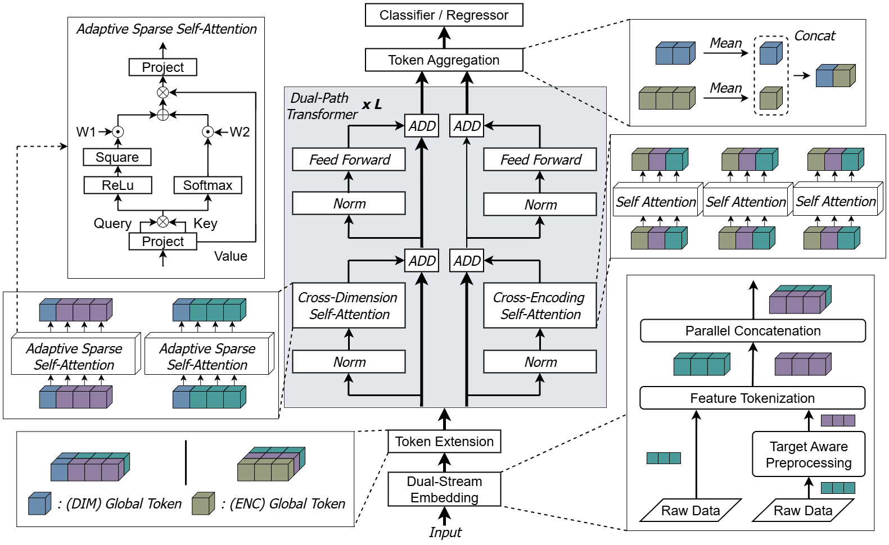

# SG-XDEAT Tabular Learning ( AAAI )

Abstract: We propose SG-XDEAT (Sparsity-Guided Cross-Dimensional and Cross-Encoding Attention with Target-Aware Conditioning), a novel framework designed for supervised learning on tabular data. At its core, SG-XDEAT employs a dual-stream encoder that decomposes each input feature into two parallel representations: a raw value stream and a target-conditioned (label-aware) stream. These dual representations are then propagated through a hierarchical stack of attention-based modules. SG-XDEAT integrates three key components: (i) cross-dimensional self-attention, which captures intra-view dependencies among features within each stream; (ii) cross-encoding self-attention, which enables bidirectional interaction between raw and target-aware representations; and (iii) an Adaptive Sparse Self-Attention (ASSA) mechanism, which dynamically suppresses low-utility tokens by driving their attention weights toward zero—thereby mitigating the impact of noise. Empirical results on multiple public benchmarks show consistent gains over strong baselines, confirming that jointly modeling raw and target-aware views—while adaptively filtering noise—yields a more robust deep tabular learner.


## 📂 Repository Structure
```
SG-XDEAT Tabular Learning/
├── Supplementary_Material/            # Supplementary resources
│ ├── Experiments/                     # Experimental results
│ │ ├── ASSA/                          # Sparsity Related experiments
│ │ ├── Architectural Comparison/      # Comparison across model architectures (  )
│ │ ├── Input Strategies/              # Different input handling strategies ( Raw & Targeted )
│ │ ├── Performance Comparison/        # Performance benchmarking
│ │
│ ├── Appendix.pdf                     # Appendix
│ ├── ReproducibilityChecklist.pdf     # Checklist
│
├── Figure/                            # Figures & Tables
├── SG-XDEAT.pdf                       # Conference Paper
├── README.md                          # Documentation
```
